<div align="center">

# CareerFlow

**A modern SaaS platform for tracking job applications, interviews, tasks, and career opportunities.**

Stop losing track of your job search across spreadsheets and inboxes — manage your entire pipeline,
from wishlist to offer, in one professional workspace.

[](.github/workflows/ci.yml)
[](backend/)
[](frontend/)
[](backend/)
[](LICENSE)

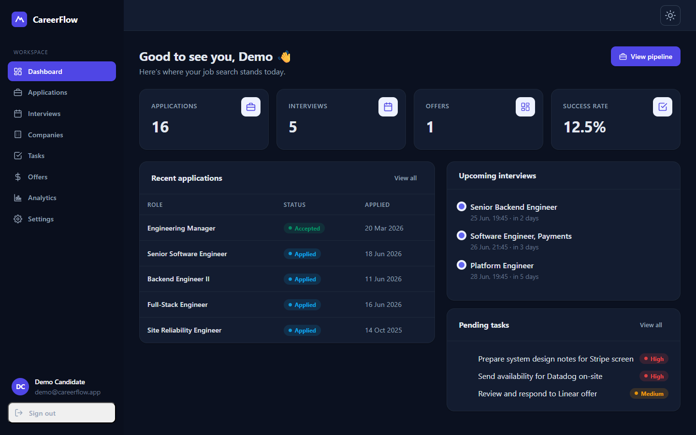

<sub>The dashboard, captured from the running application with seeded demo data.</sub>

</div>

---

## Table of contents

- [Why CareerFlow](#why-careerflow)
- [Features](#features)
- [Tech stack](#tech-stack)
- [Quick start](#quick-start)
- [Architecture](#architecture)
- [Data model (ERD)](#data-model-erd)
- [Request lifecycle](#request-lifecycle)
- [Project structure](#project-structure)
- [Development](#development)
- [Testing & quality](#testing--quality)
- [Security](#security)
- [Deployment](#deployment)
- [Documentation](#documentation)
- [Roadmap](#roadmap)
- [Known limitations](#known-limitations)
- [Future improvements](#future-improvements)
- [License](#license)

## Why CareerFlow

A typical active job search runs 20–80 applications over several months. The information that
matters — what stage each application is at, when the next interview is, who you spoke to, what
follow-up is due — ends up scattered and forgotten. CareerFlow centralizes it into a single
source of truth and turns it into something you can actually reason about, with a pipeline board,
reminders, and analytics on what's converting.

> **Try it instantly:** the stack seeds a demo account on first launch —
> **`demo@careerflow.app` / `DemoPass123!`** (pre-filled on the login screen).

## Features

- 🔐 **Secure auth** — email/password registration, bcrypt hashing, short-lived JWT access tokens with **refresh-token rotation**, and fully user-scoped data.
- 🏢 **Companies** — CRUD with search, industry filtering, and pagination.
- 💼 **Application pipeline** — eight stages (Wishlist → Applied → Assessment → Interview → Final → Offer → Rejected → Accepted), shown as a **Kanban board** or a sortable list, with salary, location, source, and links.
- 🗓️ **Interviews** — multiple rounds per application plus a dedicated cross-pipeline list filtered by upcoming/past.
- 💰 **Offers** — track base salary, bonus, equity, benefits, and your decision (pending/negotiating/accepted/declined).
- ✅ **Tasks** — priorities, due dates, completion, and semantic priority sorting.
- 📝 **Notes** — Markdown notes per application.
- 📎 **Attachments** — secure resume/cover-letter uploads (validated, owner-only download).
- 📊 **Dashboard & analytics** — headline stats, upcoming interviews, pending tasks, and Recharts visualizations (applications over time, status & industry distribution, conversion rates).
- ⚙️ **Settings** — update your profile and change your password.
- 🌗 **Polished UX** — responsive layout, light/dark themes, Zod-validated forms, and proper loading / empty / error states throughout.

## Screenshots

> Captured from the running app (`frontend/scripts/screenshot.mjs`) against the seeded demo data.

<p align="center">
  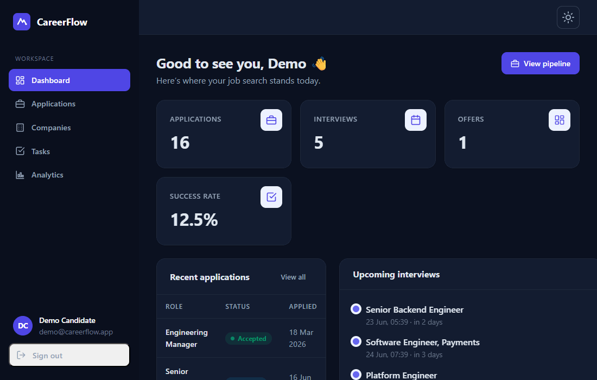
</p>

| Pipeline board | Application detail |
| --- | --- |
| 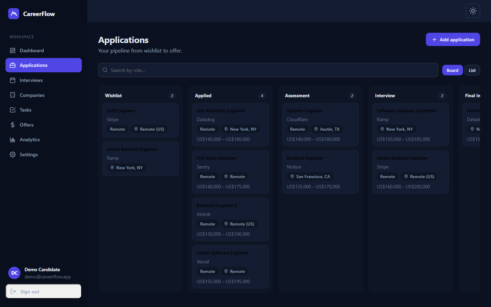 | 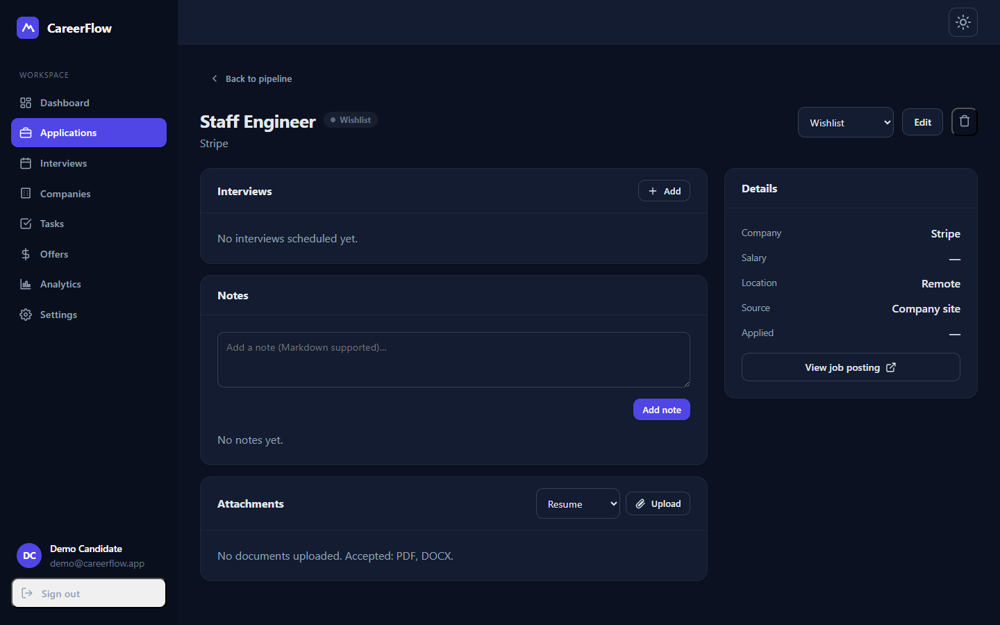 |
| **Offers** | **Interviews** |
| 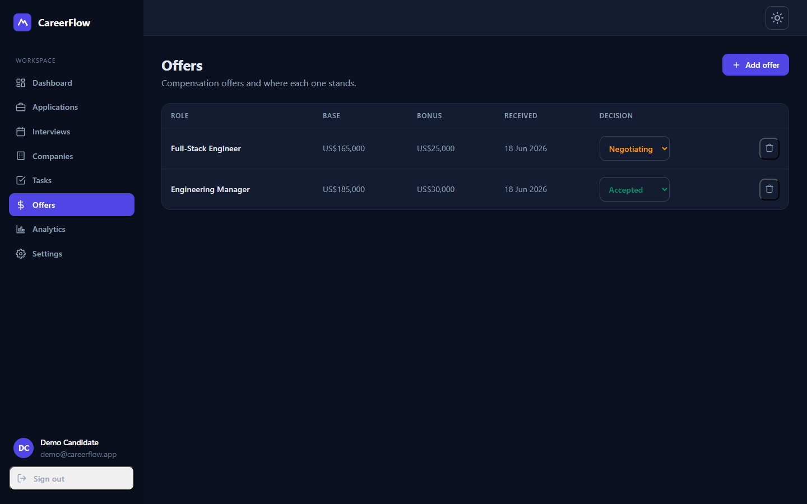 | 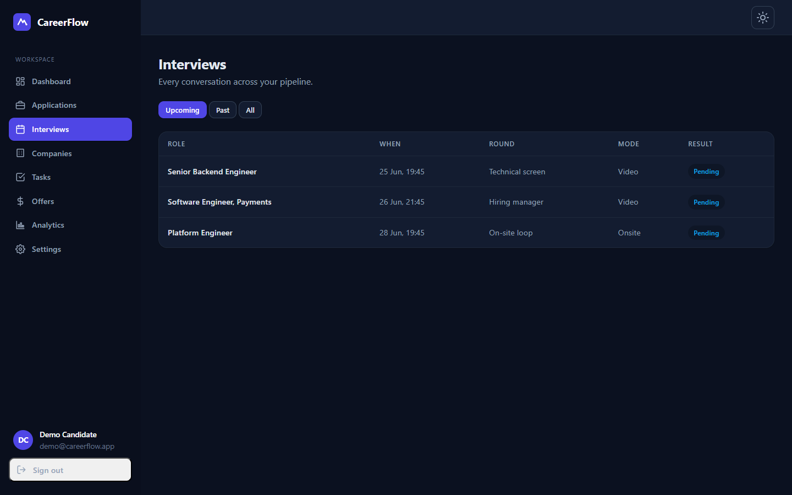 |
| **Analytics** | **Light theme** |
| 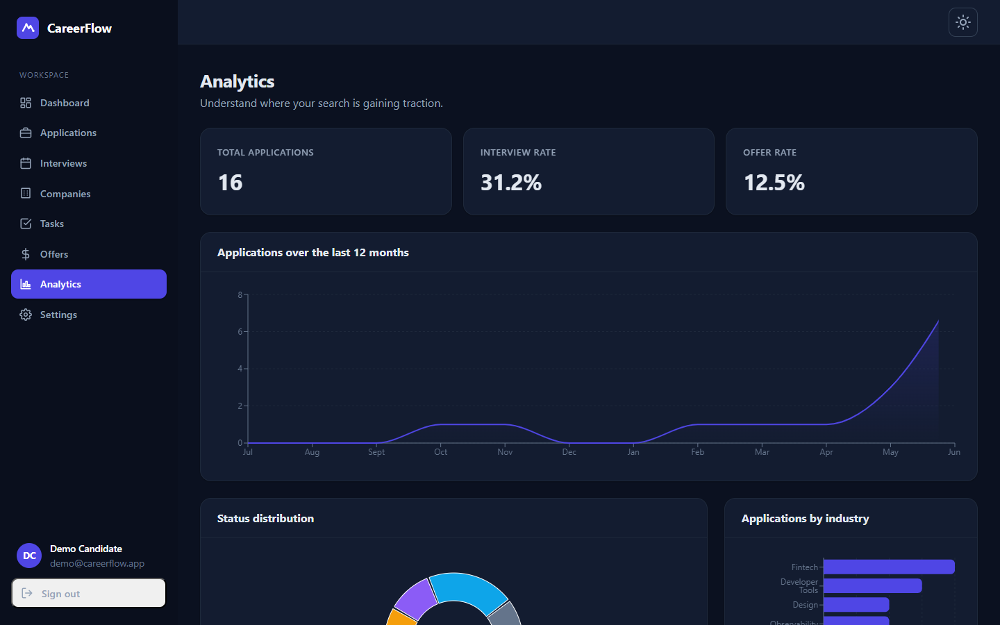 | 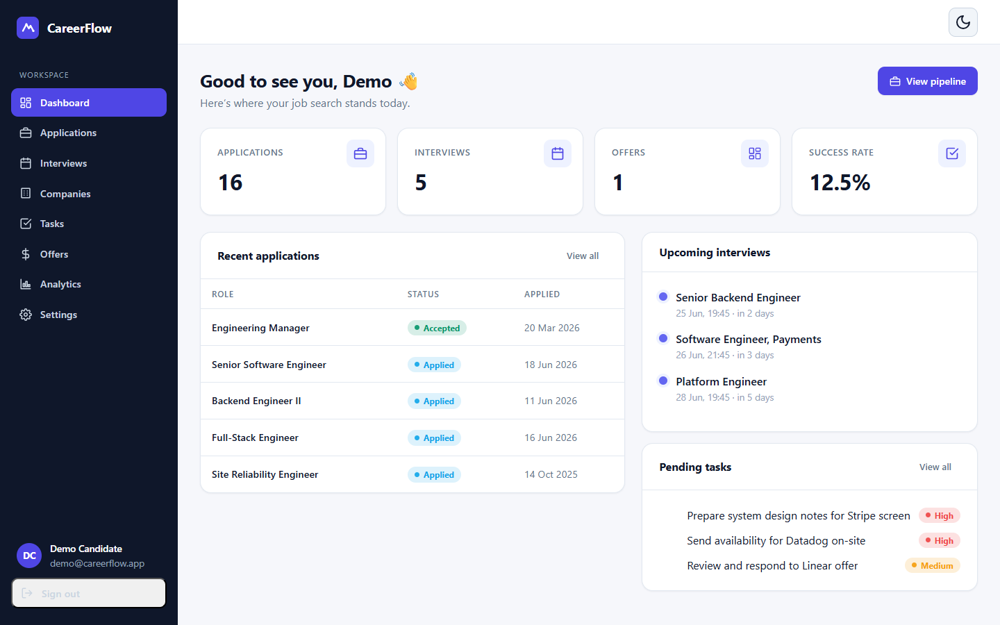 |

## Tech stack

| Layer | Technologies |
| --- | --- |
| **Frontend** | React 18, TypeScript, Vite, React Router, TanStack Query, Recharts |
| **Backend** | Python 3.11/3.12, FastAPI, SQLAlchemy 2.0, Alembic, Pydantic v2 |
| **Database** | PostgreSQL 16 |
| **Auth** | JWT (PyJWT), bcrypt |
| **DevOps** | Docker, Docker Compose, Nginx, GitHub Actions |
| **Quality** | Pytest, Vitest, Ruff, mypy, ESLint, Prettier, Bandit, pip-audit |

## Quick start

The entire platform runs with one command (requires Docker):

```bash
git clone <repo-url> careerflow
cd careerflow
docker compose up --build
```

| Service | URL |
| --- | --- |
| Web app | http://localhost:5173 |
| API (Swagger UI) | http://localhost:8000/api/docs |
| API (ReDoc) | http://localhost:8000/api/redoc |
| Health probe | http://localhost:8000/health |

The backend applies migrations and seeds the demo account automatically on first start.

## Architecture

Three tiers: a React SPA, a layered FastAPI backend, and PostgreSQL. In production Nginx serves
the built SPA and reverse-proxies `/api` to the backend, so the browser sees a single origin.

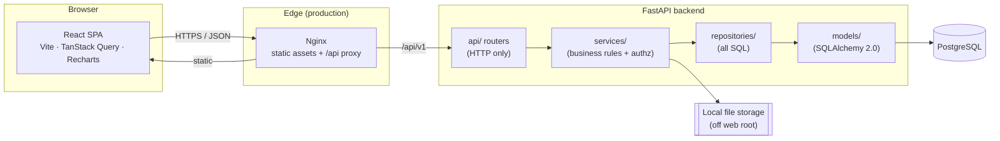

The backend enforces a strict, inward-pointing dependency rule — **routers do HTTP, services hold
business logic and authorization, repositories own all data access**. Details and rationale live in
[docs/02-technical-architecture.md](docs/02-technical-architecture.md).

## Data model (ERD)

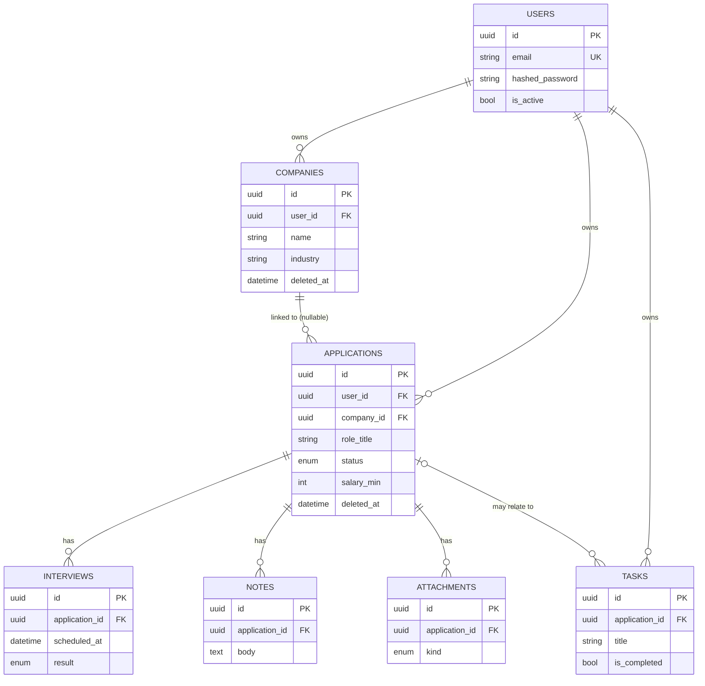

Full schema, indexes, and referential rules: [docs/03-database-design.md](docs/03-database-design.md).

## Request lifecycle

Creating an application, showing validation, authorization, and the layer hand-off:

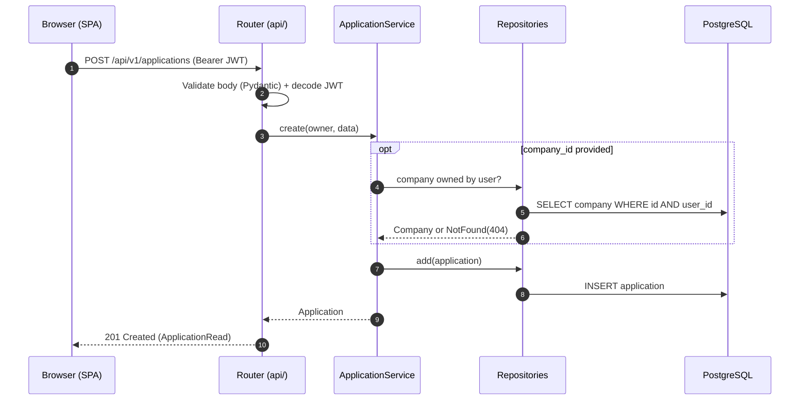

The authentication flow is diagrammed in
[docs/diagrams/sequence-auth.mmd](docs/diagrams/sequence-auth.mmd).

## Project structure

```
careerflow/
├── backend/            FastAPI service (layered: api · services · repositories · models)
│   ├── app/
│   ├── alembic/        database migrations
│   └── tests/          unit + integration tests
├── frontend/           React + TypeScript SPA (Vite)
│   └── src/            pages · components · hooks · services · contexts
├── docs/               PRD, architecture, DB & API design, security, diagrams
├── .github/workflows/  CI pipeline
└── docker-compose.yml  full-stack one-command startup
```

A deeper tour is in [docs/06-folder-structure.md](docs/06-folder-structure.md).

## Development

Run the apps natively for a tighter feedback loop.

**Backend** (Python ≥ 3.11):

```bash
cd backend
python -m venv .venv && source .venv/bin/activate   # Windows: .venv\Scripts\activate
pip install -e ".[dev]"
cp .env.example .env
alembic upgrade head
uvicorn app.main:app --reload
```

**Frontend** (Node ≥ 20):

```bash
cd frontend
npm install
npm run dev      # http://localhost:5173, proxies /api to the backend
```

## Testing & quality

Every change is gated by the same checks CI runs.

```bash
# Backend
cd backend
ruff check . && ruff format --check . && mypy app
bandit -r app && pip-audit
pytest --cov --cov-report=term-missing      # ~97% line coverage

# Frontend
cd frontend
npm run lint && npm run typecheck && npm test && npm run build
```

The backend suite (83 tests) runs against in-memory SQLite for speed and isolation; the production
target is PostgreSQL. CI enforces a **minimum 80% backend coverage** and builds both Docker images.

## Security

CareerFlow was built with a security-first mindset and audited in a dedicated phase:

- All data is **user-scoped**; cross-user access returns `404` (no existence leak).
- Passwords are **bcrypt**-hashed; auth errors are generic to prevent enumeration.
- Inputs are validated by Pydantic and persisted via bound parameters (no SQL injection).
- Uploads are type/size-validated, stored off the web root with opaque names, and served
  only to their owner.
- `bandit` and `pip-audit` run in CI and are currently clean.

See [docs/05-security-design.md](docs/05-security-design.md) and the audit in
[docs/security-review.md](docs/security-review.md).

## Deployment

The repository is container-first. `docker compose up --build` is production-shaped: the backend
image runs migrations on start, and Nginx serves the built SPA while proxying the API. For a real
deployment, override the defaults in a root `.env` (see [.env.example](.env.example)) — at minimum a
strong `JWT_SECRET` and managed Postgres credentials; the app refuses to start in `production` with a
placeholder secret.

## Documentation

| Document | Contents |
| --- | --- |
| [Product Requirements](docs/01-product-requirements.md) | Problem, personas, journeys, functional & non-functional requirements |
| [Technical Architecture](docs/02-technical-architecture.md) | Layering, technology rationale, boundaries |
| [Database Design](docs/03-database-design.md) | Tables, indexes, soft-delete & referential rules |
| [API Design](docs/04-api-design.md) | Endpoints, pagination, error format, examples |
| [Security Design](docs/05-security-design.md) / [Security Review](docs/security-review.md) | Threat model, controls, audit findings |
| [Deployment Guide](docs/deployment.md) | Hosting the frontend, backend, and database |
| [Runtime Verification](docs/verification.md) | Evidence from actual builds and runs |
| [Folder Structure](docs/06-folder-structure.md) | Repository layout and conventions |
| [Backend Review](docs/backend-architecture-review.md) / [Repository Audit](docs/repository-audit.md) | Self-reviews and refactors |

Interactive API docs are generated from the code at `/api/docs` (Swagger) and `/api/redoc`.

## Roadmap

- [x] Core domain: companies, applications, interviews, tasks, notes, attachments
- [x] Dashboard & analytics
- [x] Containerized stack + CI
- [ ] Drag-and-drop status changes on the board
- [ ] Email/calendar reminders for upcoming interviews
- [ ] CSV/JSON export of the pipeline
- [ ] Saved views and bulk actions

## Known limitations

- Single-user accounts only (no shared workspaces or collaboration).
- Editing an application from its detail page lists only its current company in the picker;
  reassignment is available from the create flow.
- Attachments are stored on local disk (a volume in Compose) rather than object storage.
- The board groups rejected applications outside the visible pipeline columns (they remain in the list view).

## Future improvements

- Refresh-token rotation and token revocation.
- Pluggable object storage (S3-compatible) for attachments.
- Full-text search across notes and applications.
- Optimistic UI updates and drag-and-drop on the pipeline board.

## License

[MIT](LICENSE) © 2026 CareerFlow
