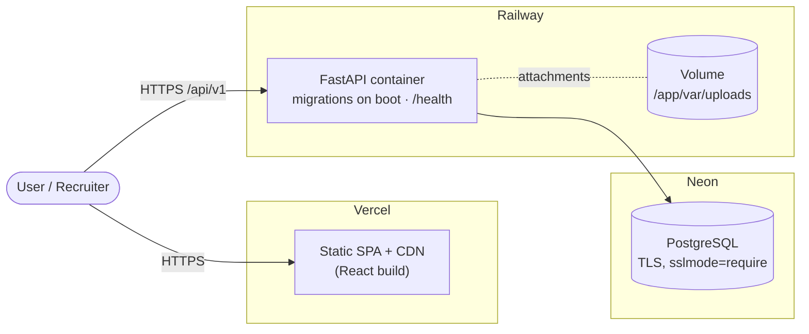

# Release v1.0.0

First production-ready release of CareerFlow — a SaaS platform for tracking job
applications, interviews, tasks, and opportunities.

## Highlights

- Full job-search pipeline: companies, applications (8-stage Kanban board),
  interviews, tasks, notes, and document attachments.
- Dashboard and analytics (applications over time, status/industry distribution,
  conversion rates).
- Secure JWT auth with fully user-scoped data.
- React + TypeScript SPA with a bespoke design system and light/dark themes.
- Container-first: one-command local stack, GitHub Actions CI, and a documented
  Vercel + Railway + Neon production topology.

See the [CHANGELOG](../CHANGELOG.md) for the complete list.

## Production deployment topology

- **TLS** is terminated by Vercel and Railway (managed certificates).
- The SPA calls the API cross-origin; `CORS_ORIGINS` is pinned to the Vercel
  origin and auth travels as a Bearer token (no cookies).
- Migrations run automatically on each backend boot.

## Operational notes

- **Health check:** `GET /health` (used by Railway).
- **Config:** all via environment variables; the app refuses to start in
  `production` with a placeholder `JWT_SECRET`.
- **Logs:** structured, request-scoped, no secrets/PII.
- **Backups:** enable on the Neon project.
- **Rollback:** redeploy a previous Railway/Vercel build; migrations are
  reversible.
- **Demo access:** set `SEED_DEMO_DATA=true` to expose
  `demo@careerflow.app / DemoPass123!` for recruiters; set `false` for a private
  instance.

## Known limitations

- Single-user accounts (no shared workspaces).
- Attachments require a Railway Volume (or object storage) to persist across
  redeploys.
- No refresh-token rotation yet; tokens are short-lived.
- No application-level rate limiting (intended at the edge/proxy).

## Future improvements

- S3-compatible object storage for attachments.
- Refresh tokens + revocation list.
- Drag-and-drop board, optimistic updates.
- Full-text search; CSV/JSON export.
